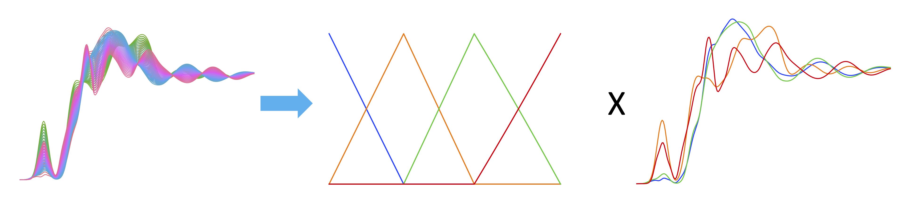

Prior Knowledge Embedding Constraints to Help the Deconvolution of Spectra Sequence 
using MCR.

For a time resolved spectra sequence D, it deconvolutes to concentration time evolution 
profile C and individual spectra for each components.

D = CS<sup>T</sup>                            | 
:--------------------------------------------:|
 | 


# Installation
```console
git clone git@github.com:xhqu1981/mcr_const.git
cd mcr_const
conda create --name mcr_py3 python=3
source activate mcr_py3
python setup.py develop
```

# Usage
The constraints in this repository is designed to be compatible with [pyMCR](https://github.com/usnistgov/pyMCR) 
from NIST. Every MCR can be initiated in the same way they would do in pyMCR.

E.g. To decompose a XANES sequence, we can use pyMCR only code:
```python
from pymcr.mcr import McrAR
from pymcr.regressors import NNLS
from pymcr.constraints import ConstraintNorm

mcrar = McrAR(c_regr=NNLS(), st_regr=NNLS(), c_constraints=[ConstraintNorm()])
spec_guess = spectra_sequence[[5, 20, 40, -3]]
mcrar.fit(spectra_sequence, ST=spec_guess)
resolved_conc = mcrar.C_opt_
resolved_spec = mcrar.ST_opt_

# Make plots for visualization
import matplotlib.pyplot as plt
import seaborn as sns
plt.figure()
sns.set_palette('bright', resolved_conc.shape[0])
for i, conc in enumerate(resolved_conc.T):
    plt.plot(conc, label=f'X Material {i+1}')
plt.legend()
plt.yticks([])
title = "Resolved Concentration"
plt.title(title)
plt.savefig(f'{title}.pdf', dpi=300)

plt.figure()
colors = sns.color_palette('bright', true_specs.shape[0])
for i, (tspec, rspec, color) in enumerate(zip(true_specs, resolved_spec, colors)):
    plt.plot(tspec, c=color, lw=1.2, label=f'X Material {i+1}') # True Spectra
    plt.plot(rspec, "--", lw=2.0, c=color) # Resolved spectra
plt.legend()
plt.xticks([])
plt.yticks([])
title = "Resolved Spectra"
plt.title(title)
plt.savefig(f'{title}.pdf', dpi=300)
```
Resolved Concentration                             |  Resolved Spectra
:-------------------------------------------------:|:-------------------------------------------:
 | 

For this specific dataset, the spectra is almost perfect (solid line are resolved value, dashed line 
are true value). However, the red and green concentration exhibit a wierd trend of first going to 
zero and then going up again. In addition, there are more than 2 phases in the same point which is 
against phase law. To solve this problem, we can apply the rank selectivity constraint.

### Rank Selectivity Constraint
This constraint is available via module ```mcr_const.constraints.nist``` in this repository and comes with a constructor 
for flexible targeting region definition using numpy advanced indexing. In parallel, we have provided a helper function 
```from_xxx()``` as a ```classmethod``` to make ease usage of the constraint for simple questions. The following code is 
an example on how to use this constraint:
```python
from pymcr.mcr import McrAR
from pymcr.regressors import NNLS
from pymcr.constraints import ConstraintNorm
from mcr_const.constraints.nist import ConstraintPointBelow

rank_selectivity = ConstraintPointBelow.from_phase_law(
    n_species=4,
    sequence_length=spectra_sequence.shape[0],
    interface_positions=[19, 37],
    threshold=1.0E-5
)

mcrar = McrAR(c_regr=NNLS(), st_regr=NNLS(),  c_constraints=[ConstraintNorm(), rank_selectivity])
spec_guess = spectra_sequence[[5, 20, 40, -3]]
mcrar.fit(spectra_sequence, ST=spec_guess)
resolved_conc = mcrar.C_opt_
resolved_spec = mcrar.ST_opt_

# Make plots for visualization
import matplotlib.pyplot as plt
import seaborn as sns
plt.figure()
sns.set_palette('bright', resolved_conc.shape[0])
for i, conc in enumerate(resolved_conc.T):
    plt.plot(conc, label=f'X Material {i+1}')
plt.legend()
plt.yticks([])
title = "Resolved Concentration"
plt.title(title)
plt.savefig(f'{title}.pdf', dpi=300)


plt.figure()
colors = sns.color_palette('bright', true_specs.shape[0])
for i, (tspec, rspec, color) in enumerate(zip(true_specs, resolved_spec, colors)):
    plt.plot(tspec, c=color, lw=1.2, label=f'X Material {i+1}') # True Spectra
    plt.plot(rspec, "--", c=color, lw=2.0) # Resolved spectra
plt.legend()
plt.xticks([])
plt.yticks([])
title = "Resolved Spectra"
plt.title(title)
plt.savefig(f'{title}.pdf', dpi=300)
```
Resolved Concentration                             |  Resolved Spectra
:-------------------------------------------------:|:-------------------------------------------:
 | 

It is intuitive that not only the concentrations conforms to physical law now, but also spectra quality shows 
improvement. The underlying ConstraintPointBelow class pushes concentration to zero at certain regions, which makes use of
the information obtained from prior knowledge.

### Smoothing Constraint
The smoothing constraint is designed to smooth noisy profile, for concentration or/and spectra. Similarly, it comes with
a helper function for simplified construction. It is worth note that we need to specify ```var_type``` parameter to
specify whether concentration or spectra is the target of constraint to be created:
```python
from pymcr.mcr import McrAR
from pymcr.regressors import NNLS
from mcr_const.constraints.nist import ConstraintSmooth, VarType


smooth_conc_1 = ConstraintSmooth.from_range(
    i_specie=0, 
    i_range=(0, spectra_sequence.shape[0]),
    exponent=5,
    smoothing_factor=0.02
)
smooth_conc_2 = ConstraintSmooth.from_range(
    i_specie=1, 
    i_range=(0, spectra_sequence.shape[0]),
    exponent=5,
    smoothing_factor=0.02
)

smooth_spec_1 = ConstraintSmooth.from_range(
    i_specie=0, 
    i_range=(0, spectra_sequence.shape[1]),
    exponent=2,
    smoothing_factor=0.1,
    var_type=VarType.SPECTRA
)
smooth_spec_2 = ConstraintSmooth.from_range(
    i_specie=1, 
    i_range=(0, spectra_sequence.shape[1]),
    exponent=2,
    smoothing_factor=0.1,
    var_type=VarType.SPECTRA
)
mcrar = McrAR(c_regr=NNLS(), st_regr=NNLS(), tol_increase=1.0,
              c_constraints=[smooth_conc_1, smooth_conc_2],
              st_constraints=[smooth_spec_1, smooth_spec_2])
spec_guess = spectra_sequence[[5, -5]]
mcrar.fit(spectra_sequence, ST=spec_guess)
resolved_conc = mcrar.C_opt_
resolved_spec = mcrar.ST_opt_

# Make plots for visualization
import matplotlib.pyplot as plt
import seaborn as sns
plt.figure()
colors = sns.color_palette('bright', resolved_conc.shape[0])
for i, (conc, nc, color) in enumerate(zip(resolved_conc.T, noisy_conc.T, colors)):
    plt.plot(conc, c=color, label=f'X Material {i+1}')
    plt.plot(nc, lw=0.5, c=color)
plt.legend()
plt.yticks([])
title = "Resolved Concentration"
plt.title(title)
plt.savefig(f'{title}.pdf', dpi=300)

plt.figure()
colors = sns.color_palette('bright', resolved_spec.shape[0])
for i, (spec, ns, color) in enumerate(zip(resolved_spec, noisy_spec, colors)):
    plt.plot(spec, lw=1.2, c=color, label=f'X Material {i+1}')
    plt.plot(ns, lw=0.5, c=color)
plt.legend()
plt.xticks([])
plt.yticks([])
title = "Resolved Spectra"
plt.title(title)
plt.savefig(f'{title}.pdf', dpi=300)
```
Resolved Concentration                             |  Resolved Spectra
:-------------------------------------------------:|:-------------------------------------------:
 | 


For more details see the class definitions and the notebooks in [Examples](./examples).

# Get help
Send an email to [Xiaohui Qu](mailto:xiaqu@bnl.gov) at BNL/CFN.
